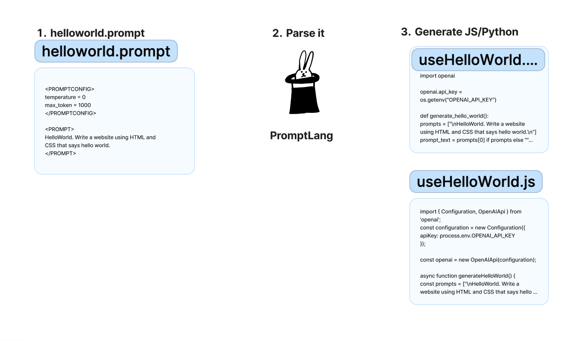

# Prompt Lang

What if there was a programming language for writing prompts? This is an experiment see what a prompt language could feel like.

Workflow:
  
1. Write a prompt file and specify the prompt and prompt configurations.
```helloworld.prompt
<PROMPTCONFIG>
temperature = 0
max_token = 1000
</PROMPTCONFIG>

<PROMPT>
HelloWorld. Write a website using HTML and CSS that says hello world.
</PROMPT>
```

2. Run parser.js to parse the `helloworld.prompt` file and generate helper functions to use in Javascript and Python.
```
node parser.js
```

3. Set your .env file with your openai API key and run the generated prompt helpers
```
node examples/helloworld/use_prompt.js
python examples/helloworld/use_prompt.py
```


Imagine if we could extend this simple example and fully extract all the logic from working with LLMs into just one prompt file that could look like something below. Imagine if the parser could just generate langchain code or even more fully formed projects. That way, LLMs would just need to learn how to write prompts and then use a parser like this to execute it.

```latex.prompt
# Converts a user input into latex code

## LATEXIFIER
<PROMPT_CONFIG>
temperature = 0
max_token = 1000
</PROMPT_CONFIG>

<INPUT>
PROMPT=string
</INPUT>

<BEGINPROMPT variant="basic">
// Initial instructions
You convert English into LaTeX. 

// Examples
Here are some examples:
English: Create a document
LaTeX: \documentclass{article}
\begin{document}
First document. This is a simple example, with no 
extra parameters or packages included.
\end{document}

English: {PROMPT}
LaTeX:
<ENDPROMPT>

<BEGINPROMPT variant="few-shot">
You convert English into LaTeX. 

For example:
LOOP($:EXAMPLES)

English: $:PROMPT
LaTeX:
<ENDPROMPT>


<OUTPUT>
output:string
</OUTPUT>
```
